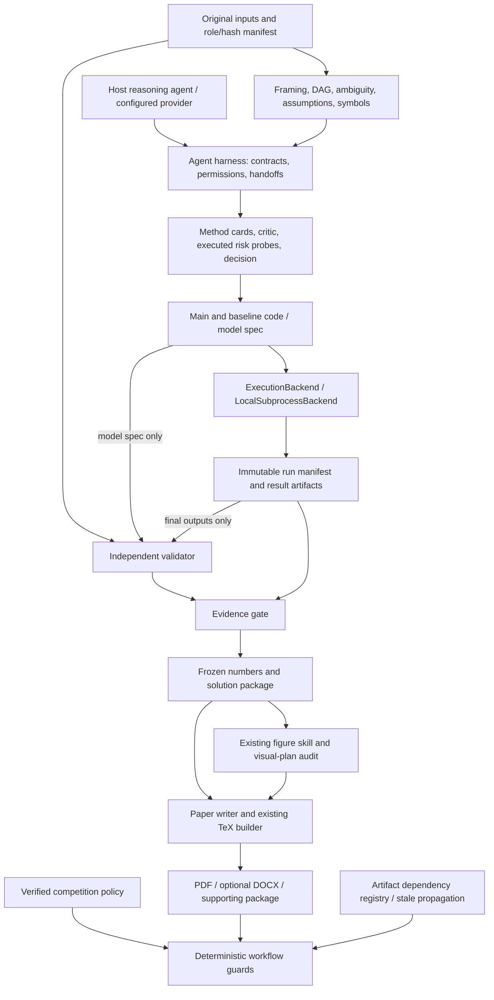
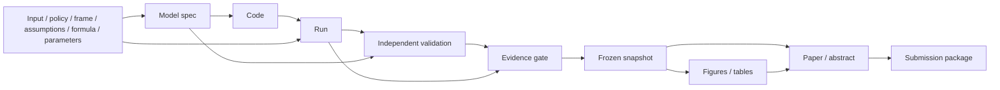

# MathMode V2 architecture (T02 design)

Status: approved implementation direction under `goal.md`; this document is a
design, not evidence that later stages are implemented. Source rationale is in
[reference source map](research/reference_source_map.md). Preserve the existing
visual assets and TeX-first pipeline; add the missing evidence-producing runtime.

## Components and ownership

`mathmode/` is the shared Python package. Keep CLI adapters in existing tool
locations and expose shared runtime commands with `python -m mathmode`. JSON
schemas live in `华为杯_求解规范/schemas/`. The runtime must remain usable with an
explicit Conda interpreter; core gates need no Word, font installation or LLM API.

| Module/service | Owns | Does not own |
| --- | --- | --- |
| Contracts and paths | Strict JSON/schema validation, IDs, bounded relative paths, hashes, atomic writes | Scientific judgments or implied official rules |
| Policy | Versioned official sources, template hash, cover/body scopes, TOC, edition, pages, AI and submission requirements | Historical recommendations as official obligations |
| State/lineage | Artifact registry, dependencies, gate observations, retries, append-only events | Independent approval of its own model |
| Execution backend | Actual argv/interpreter/cwd, seed, environment summary, timing, exit status, pre/post input/code/output hashes | Mathematical validity or OS isolation claims |
| Independent validator | Recompute metrics, constraints, units, conservation, oracle comparisons using original inputs/spec/final outputs | Importing the main algorithm or trusting its supplied PASS |
| Evidence gate | Required evidence coverage, fresh hashes, finite metrics, baseline, successful independent validation | LLM scores as sole acceptance |
| Freeze service | Immutable numbered snapshots, source locators, tamper checks, thaw/refreeze history | Manual overwriting or silent reuse after upstream edits |
| Agent harness | Real provider/host calls, role-scoped inputs and outputs, bounded critic loop, honest provenance | Fixed toy scripts masquerading as model reasoning |
| Existing visual/paper tools | Figure rendering/QA, TeX assembly, formatting, optional Word conversion | New numerical facts outside frozen results |

## Workspace and trust boundary

Formal competition workspaces default to `../competitions/<case-id>/`, outside
the public template repository. Init rejects the template root and descendants
for formal runs; synthetic fixture workspaces are explicit and disposable.
Original `题目/` and `数据/原始/` files are imported with recorded roles/hash and
read-only copies. Generated artifacts remain under `求解/` and `论文/`. Root
templates, DOCX and skill assets are never edited by a modeling run.

Every configured input/output path is resolved and checked against its allowed
root; absolute paths, traversal, symlinks/junction escapes, duplicate canonical
paths and input/output collisions fail before mutation. User-selected interpreter
is an explicit executable path, not a shell string. Model argv is a list; no
`shell=True`, ambient PATH selection of Python or silent environment repair.

Local execution is for trusted generated code. An input bundle and restricted
tool interface reduce accidental reads, but cannot contain malicious code with
the user's OS privileges. Backend capabilities explicitly report filesystem,
network, CPU and memory isolation; unsupported limits cannot be labeled enforced.
Keep a future Docker/remote backend interface, without unused dependency stacks.

Input/code snapshots are immutable per run. Record hashes before execution and
verify again afterward. Each attempt uses a new output directory, so old results
cannot satisfy a successful run. Require all declared outputs to be created and
nonempty. Final-output collection rejects unregistered files when a submission
contract requires an exact set. Log stdout/stderr hashes and bounded summaries;
retain full logs for failure, warning, reproduction or submission profile.

The local workspace owner is trusted. SHA-256 detects accidental/tampered changes
relative to recorded evidence, but does not cryptographically authenticate an
attacker who can rewrite the entire disk. Deterministic independent recomputation
is therefore required in addition to manifests and writer restrictions.

## Modeling and independent validation

Frame all requested subquestions before choosing methods. A five-view council
(optimization, statistics, mechanism, engineering, innovation) can propose
applicable ideas; a critic filters them against the same inputs and requirements.
Each question retains one main candidate, one baseline that can perform the real
task and at most one conditional fallback with a measured trigger. A diagnostic
reference cannot stand in for the baseline. Probe executability, representative
coverage, assumptions, degeneracy, perturbations and scale before full code.

Thresholds and validation plans are recorded before inspecting final outcomes.
The validator runs separately with an allowlisted bundle of original data,
model spec, official criteria, main/baseline final outputs and independent
validator code. It does not receive solver source or intermediate model state.
Validation code has its own hash, actor identity and execution record. Matching
author identities or importing the main solver fail the independence checks.

Provide computed fixture evaluators for regression, optimization, time series,
mechanism and graph/scheduling. Check predictions/residuals from held-out rows,
objective/feasibility/bounds from decision variables, chronological splits and
train-only transformations, conservation/units and path/schedule validity.
Numerical tolerances belong to the model/official contract; do not hardcode
universal optimality claims, confidence levels or required model counts.

## Freeze and transitive invalidation

Each node stores the hashes of its dependencies at production time. On every
guard/resume/final audit, compare current bytes, detect missing nodes and traverse
all descendants. Missing/changed upstreams mark dependent nodes `STALE`, including
already-frozen snapshots' current validity and downstream questions. Never
rewrite an old snapshot to pretend it is fresh. `thaw(reason)` appends history,
invalidates consumers and permits a new run/validation/freeze version.

Paper numbers are referenced by frozen ID, using generated TeX macros and a
claim manifest. Macros obtain value/unit/precision from a verified freeze, with
artifact locators, not copied console text. Audit manifest citations and TeX
closure; undocumented empirical numeric claims block the writer handoff. Constants,
equation coefficients and structural numbering are distinguished with explicit
source/type, not an unreliable blanket ban on every digit in TeX.

## Compatibility, stages and verification

V1 schema versions remain readable by explicit adapters; legacy metadata is
`UNVERIFIED`, never upgraded to evidence PASS by filling defaults. V2 adapters
require lineage at render/paper/final stage while keeping plan/init work usable.
Build packages in a validated staging directory, then replace only the managed
snapshot after success. Migration keeps original files and emits reports.

T03 implements policy first; T04 state contracts; T05 runner; T06 validation/gate;
T07 freeze; T08 harness; T09 legacy integration; T10 CI/fixtures; T11 actual public
historical problem; T12 release audit. Each stage has a separate green commit.
An engineering fixture is not official compliance. Unknown official rules keep
G0/G8 blocked for final submission even while engineering implementation proceeds.

Release requires the 30 acceptance items in `goal.md`, Windows 3.11/3.12 CI PASS,
computed positive fixtures, at least the thirteen specified negative cases, one
complete historical dry run, clean Git status, migration/changelog and PR. Stop
at READY FOR REVIEW after CI; do not merge without explicit authorization.
