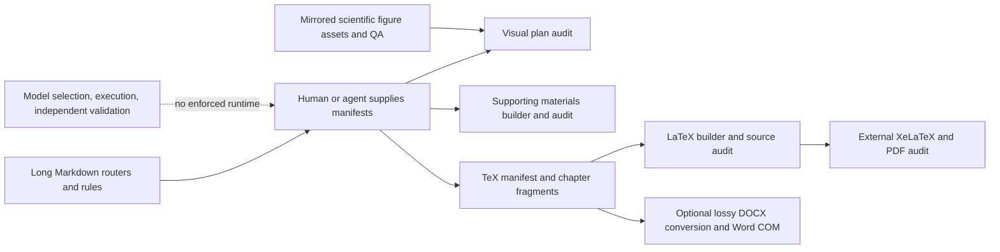

# T00 — Current repository forensics

Audit date: 2026-09-08. Engineering baseline: `d3b3f4803b46c68cb261363a17c7c0d78d7bcd53`.
Initial import: `b347703a71439ebb97df3df86df6f499097c301f`. The intervening remote
research note was retained by fast-forwarding `feat/mathmode-v2-evidence-runtime`.
The user's `goal.md` and `git_rule.md` are preserved as the implementation specification.

## Scope and reproducibility

`current_repository_inventory.json` enumerates all 587 tracked blobs (181,175,852
bytes), their SHA-256, size and type. All UTF-8 text was decoded for location-based
rule/contact/credential review; all 138 Python files were parsed and compiled
without executing model code; all 27 JSON files were parsed and schemas checked.
Binary assets were hashed; DOCX package/XML structure was inspected. There were
no inventory inspection errors. This does not imply every image is scientifically
correct or every PDF was visually inspected.

All twelve solving/paper tool implementations and their three schemas, both root
routers, solving/plotting/chapter rules, paper README, page targets, LaTeX class,
title component and Word rendering script were read. The figure skill's hub,
composition, font/QA and evaluation code were inspected for integration boundaries.
Tracked `.agents` and `.claude` figure skill mirrors are byte-identical. Cache files
are not part of that comparison. No solver or official contest result exists in
the starter problem/data/solution/paper directories.

Reproduce inventory with Python 3.11+ and jsonschema:

```powershell
python tools/audit_repository.py --revision d3b3f48 --output docs/audit/current_repository_inventory.json
```

`tools/probe_v1_baseline.py` must be run against V1 (use `--root` pointing to a
separate checkout of the pinned baseline after V2 changes). The recorded
`v1_negative_probe.json` was produced with Conda `test`, Python 3.12.13. It uses
disposable engineering inputs, never real or fabricated contest conclusions.
The probe is an observation of V1 defects, not a regression test that should
continue to accept unsafe outputs. V2 tests must reject these inputs.

## Actual architecture



The repository is a valuable visual/paper toolkit with prompt-level modeling
guidance. It is not yet an execution-backed modeling runtime. There is no root
runtime package, dependency declaration, modeling test suite or GitHub Actions
pipeline. Skill-local evaluation scripts assess assets and prompts, not independent
model correctness. README claims about root exemplar PDFs, production paper TeX
and existing demonstration audit outputs do not match the current tracked tree.

## Findings and required treatment

| ID | Actual source / observation | Consequence | Treatment stage |
| --- | --- | --- | --- |
| R01 | Supporting audit trusts declared `run_verification.status` and nonempty record | Unexecuted raising code passes final audit; reproduced | T05/T06/T09 |
| R02 | Visual audit trusts `qa_pass`, ignores report content and image decoding | Plain text PDF/PNG and QA FAIL pass render audit; reproduced | T09 |
| R03 | PDF reference/page raw regexes are overescaped | Ordinary headings and page `12` do not match; reproduced | T03 |
| R04 | TeX comment removal splits escaped percent | Valid `\\text{95\\%}` becomes unbalanced; reproduced | T03/T09 |
| R05 | PDF audit enforces default minimum 45; calibration regenerates it | Historical heuristic masquerades as delivery requirement | T03 |
| R06 | Builders hardcode edition and TOC; anonymity scans full document | Cannot represent different editions or identity-bearing official covers | T03 |
| R07 | Builders/auditors use partial manual manifest validation | Invalid IDs/types, cross-file references and paths escape contract checks | T04/T09 |
| R08 | Supporting builder deletes managed outputs before full source validation | Failed rebuild can destroy last usable snapshot | T09 |
| R09 | No independent evaluator, frozen-number authority or stale graph | Hashes certify copied files, not scientific correctness or freshness | T05–T07 |
| R10 | Paper writer receives arbitrary TeX numbers | Abstract, paper, figures and results can disagree | T07/T09 |
| R11 | Markdown migrator emits incompatible chapter fields | Legacy import cannot round-trip through current schema | T09 |
| R12 | DOCX converter handles a limited TeX subset; Word heading keys differ from PDF audit | Word is an optional derivative, not equivalent scientific source | T03/T09 |
| R13 | Missing TOC in TeX audit is recorded as okay; visual warnings can still say PASS | Incomplete checks appear verified | T03/T09 |
| R14 | Privacy ignore rules omit environment secrets and competition workspaces | Public template repo can accidentally collect local/private artifacts | T04/T12 |

Other source concerns: `audit_paper.py --source` is unused, inferred reference
boundaries and overlapping role ranges can miscount pages, source import scanning
misses dynamic/relative dependencies, and scientific quality is not established
by file existence or declared figure count. These belong in negative regression
fixtures, not additional prose-only gates.

## Protected assets, policy and privacy

Preserve original DOCX, figures, `gmcmthesis.cls`, `gmcm-title.sty`, bibliography
assets, figure skill and original author attribution. `gmcm-title.sty` controls
visual parameters; policy changes should parameterize callers. The LaTeX class
credits latexstudio/andy123t, which does not establish organizer provenance.
The local DOCX filename identifies an edition but does not verify current official
rules. Current official rule URLs, scope and template hashes must be explicitly
verified before policy/final submission gates can pass.

The figure skill includes Apache-2.0 licensing. Root/template redistribution
provenance remains unresolved; this audit does not grant or rewrite a license.
Only engineering metadata and synthetic test artifacts are added here. Contact
matches in existing third-party attribution/templates need contextual review;
regex scanning is not proof of absence of private identity data. Research clones
remain outside the public repository, as must formal contest workspaces.

## Baseline gate

T00 **PASS** means the baseline inventory and source audit are complete and the
four negative probes have reproduced the defects above. V1 scientific evidence
and contest compliance are **NOT VERIFIED**. `pytest`, jsonschema, NumPy, SciPy,
pandas and PyMuPDF are available in Conda `test`; `python-docx` is absent and
XeLaTeX, Rscript and pdfinfo were not found on PATH. Full paper rendering is not
claimed. Subsequent stages must replace unsafe acceptance with deterministic
checks and run the required positive and negative fixtures.
